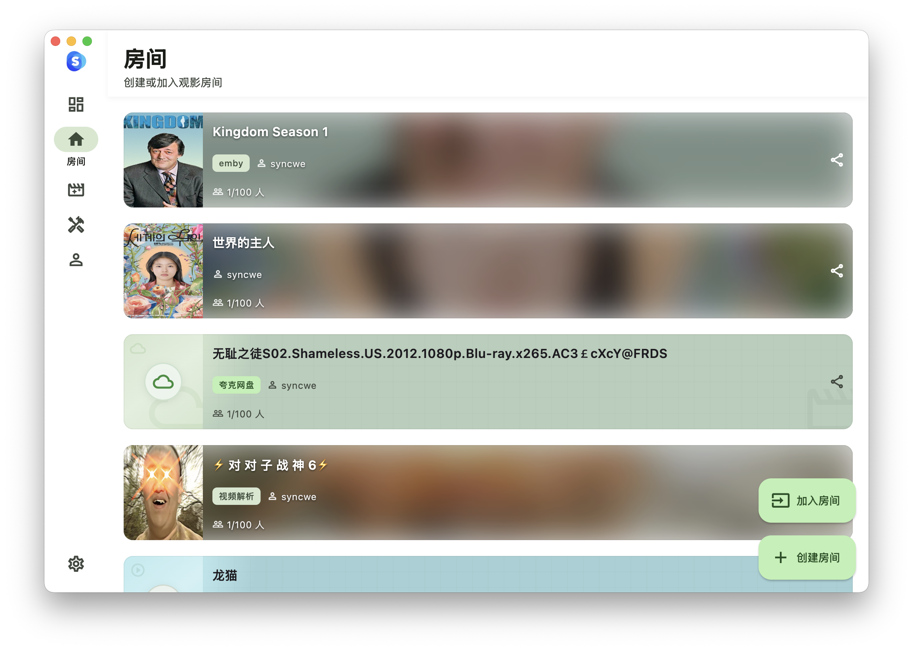
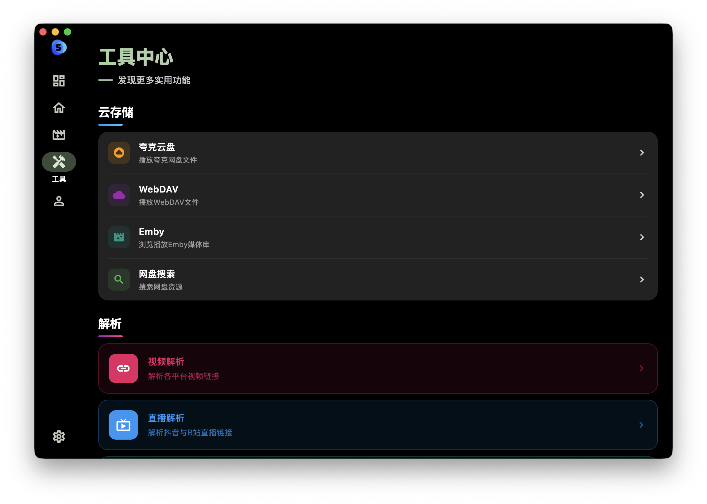
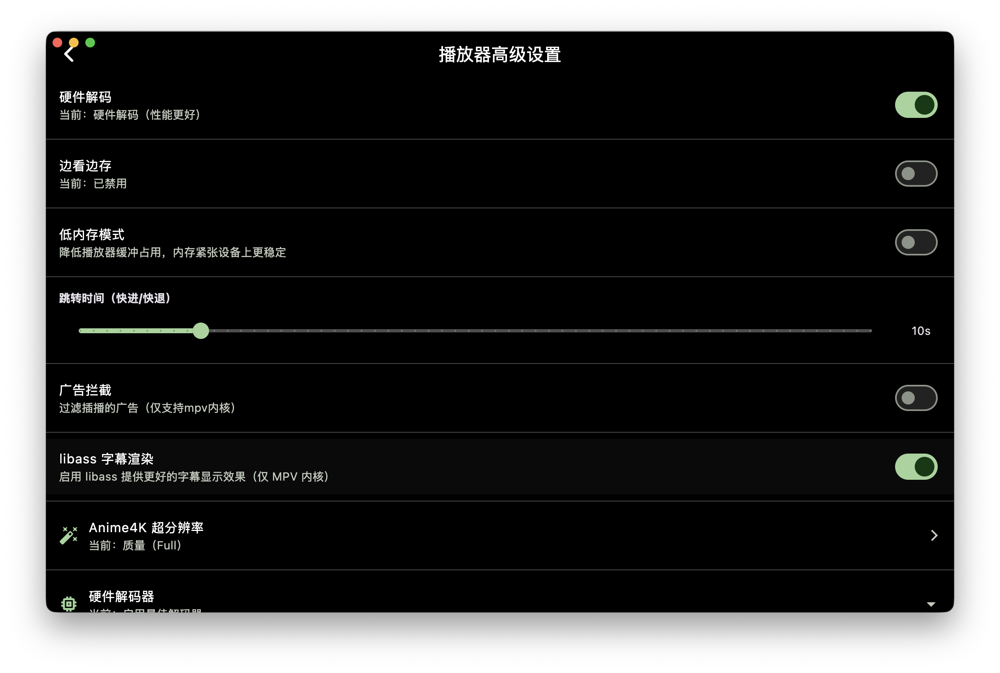
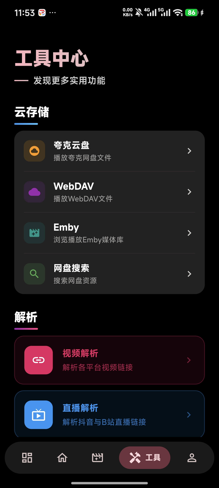
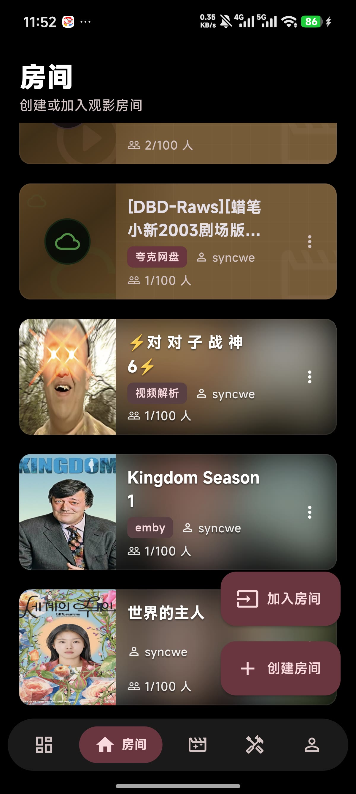

[📥 Download](https://syncwe.top/download) &nbsp;•&nbsp;
[📖 Docs](https://syncwe.top) &nbsp;•&nbsp;
[🔄 Changelog](https://syncwe.top/changelog) &nbsp;•&nbsp;
[❓ Help](https://syncwe.top/help)

---

## 🎯 What is Syncwe?

**Syncwe（一起看）** is a cross-platform synchronized video watching app built for long-distance friends and families. Watch movies, anime, and live streams together — as if you're sitting on the same couch.

> **三内核播放器 · 多源支持 · 弹幕互动 · 跨平台全覆盖**

---

## ✨ Feature Highlights

<table>
<tr>
<td width="50%">

### 🎬 Multi-Engine Player
Built-in **ExoPlayer/AVKit + mpv + mdk** — three playback engines, switch freely for the best experience.

- 🎯 Universal format support — plays virtually anything
- ⏩ 0.5x–4x speed · multi-track audio · external subtitles · PiP
- 💬 Cross-platform danmaku from all major streaming services

</td>
<td width="50%">

### ☁️ Cloud Drive Streaming
Stream videos directly from **Quark Netdisk** — no download, no wait.

- 📂 Browse disk directories, select episodes, play instantly
- ⚡ Lightning-fast startup with HD quality
- 🔄 Also supports **WebDAV / Alist** mounts

</td>
</tr>
<tr>
<td width="50%">

### 🖥️ Emby Integration
Connect your **Emby media server** — your entire library at your fingertips.

- 📚 Full library browsing, search & categorization
- 🎞️ Poster wall display — native client-level experience
- 👥 Sync-watch Emby content with friends

</td>
<td width="50%">

### 🎥 Synchronized Viewing
Real-time sync technology keeps everyone exactly in frame.

- ⏱️ Second-level synchronization across all devices
- 👥 Multi-person rooms with live chat
- 🎮 Host controls: play, pause, seek — everyone follows

</td>
</tr>
</table>

---

## 📸 Screenshots

### 🖥️ Landscape

  <table>
    <tr>
      <td align="center"></td>
      <td align="center"></td>
    </tr>
    <tr>
      <td align="center"></td>
      <td align="center"></td>
    </tr>
  </table>

### 📱 Portrait

  <table>
    <tr>
      <td align="center"></td>
      <td align="center"></td>
      <td align="center"></td>
      <td align="center"></td>
    </tr>
  </table>

---

## 🛠️ Platform Support

  <table align="center">
    <tr>
      <td align="center" width="25%"><h3>🤖</h3><b>Android</b> 7.0+</td>
      <td align="center" width="25%"><h3>🍎</h3><b>iOS</b> 14.0+</td>
      <td align="center" width="25%"><h3>🪟</h3><b>Windows</b> 10+</td>
      <td align="center" width="25%"><h3>🍏</h3><b>macOS</b> 10.15+</td>
    </tr>
  </table>

---

## 🔗 Quick Links

| | |
|---|---|
| 🌐 **Website** | [syncwe.top](https://syncwe.top) |
| 📥 **Download** | [syncwe.top/download](https://syncwe.top/download) |
| 📖 **Documentation** | [syncwe.top](https://syncwe.top) |
| 📦 **Video Source Rules** | [SyncweApp/SyncweRules](https://github.com/SyncweApp/SyncweRules) |
| 📧 **Contact** | [contact@syncwe.top](mailto:contact@syncwe.top) |

---

## 📊 Star History

<picture>
  <source media="(prefers-color-scheme: dark)" srcset="https://api.star-history.com/svg?repos=SyncweApp/syncwe&type=Date&theme=dark" />
  <source media="(prefers-color-scheme: light)" srcset="https://api.star-history.com/svg?repos=SyncweApp/syncwe&type=Date" />
  
</picture>

---

**Syncwe — 让距离不再是问题，一起看更精彩** 🍿

Made with ❤️ by the Syncwe Team · © 2025–2026

