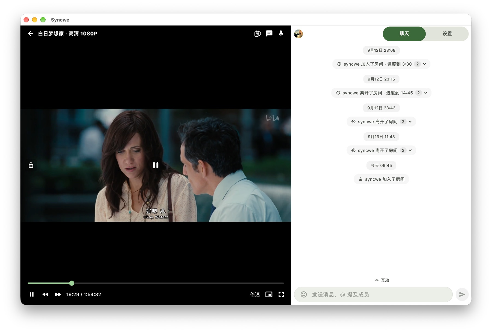
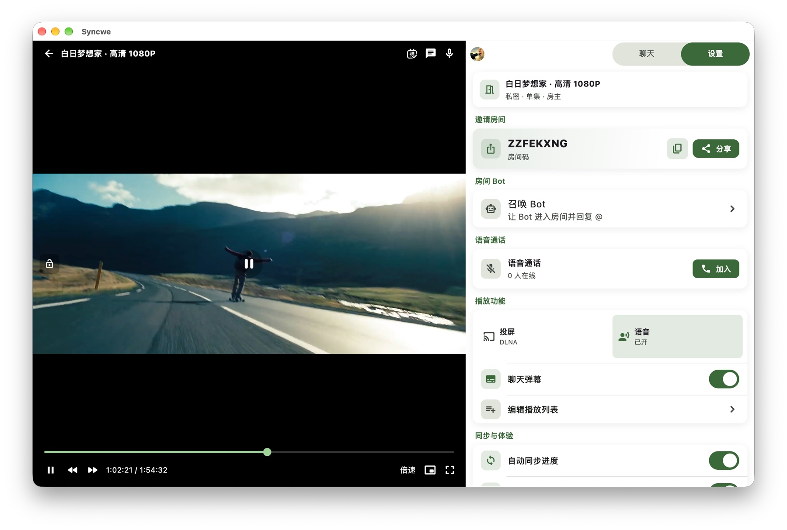
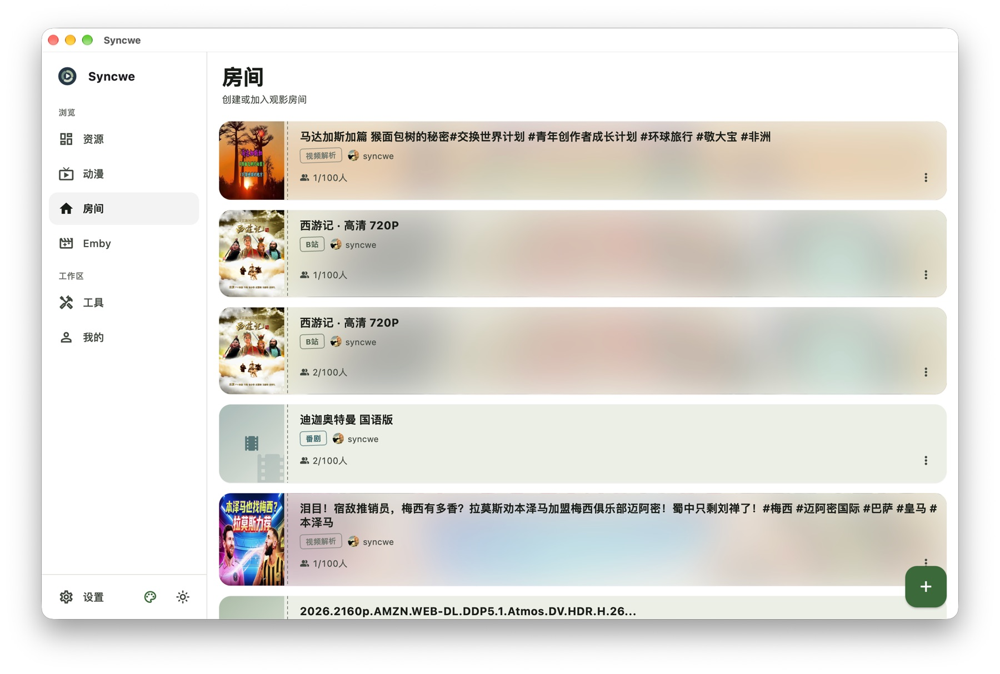
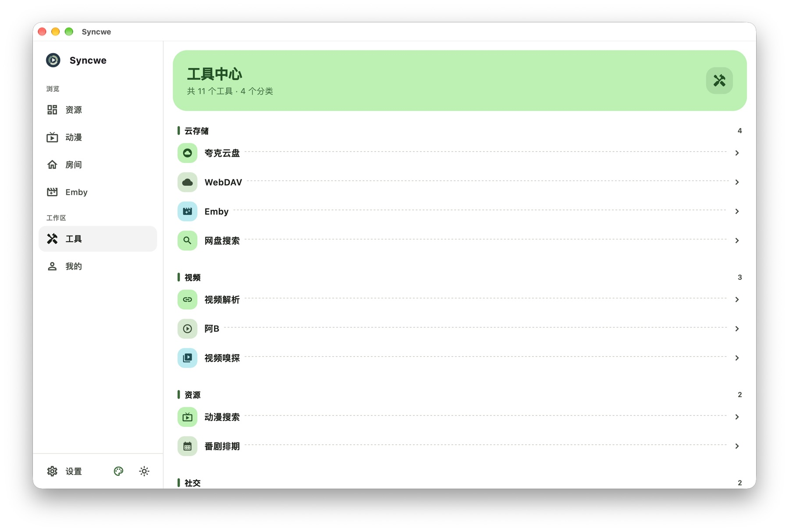
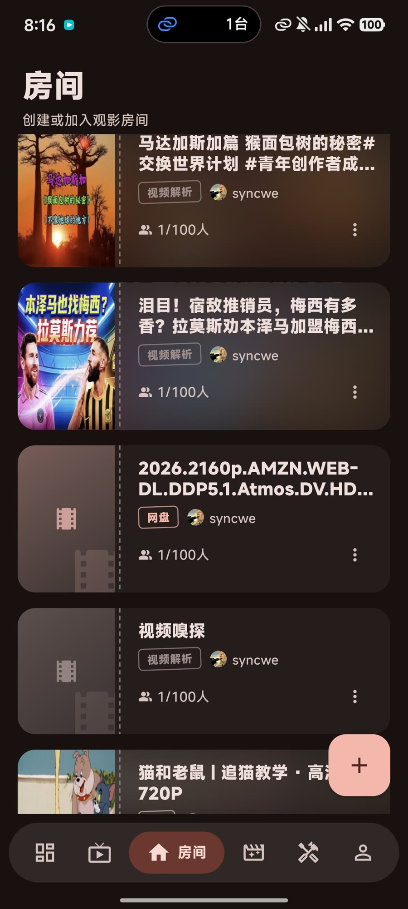
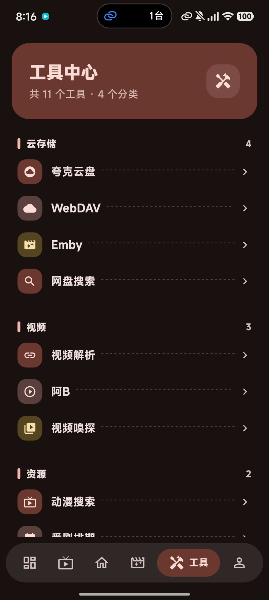
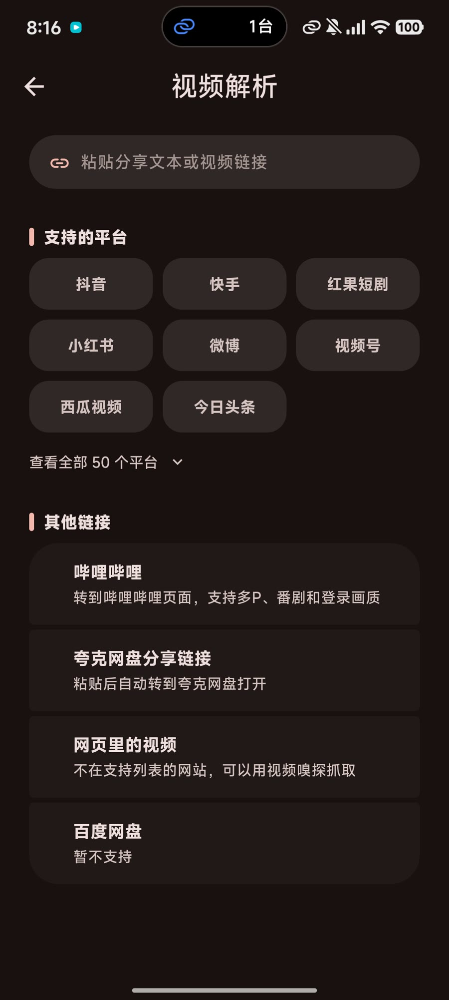
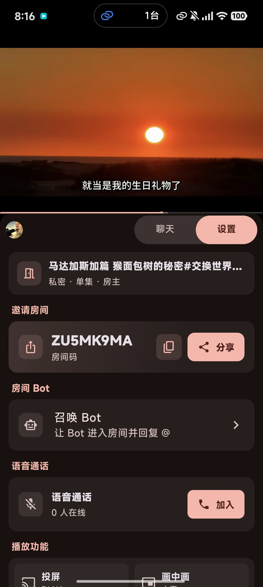
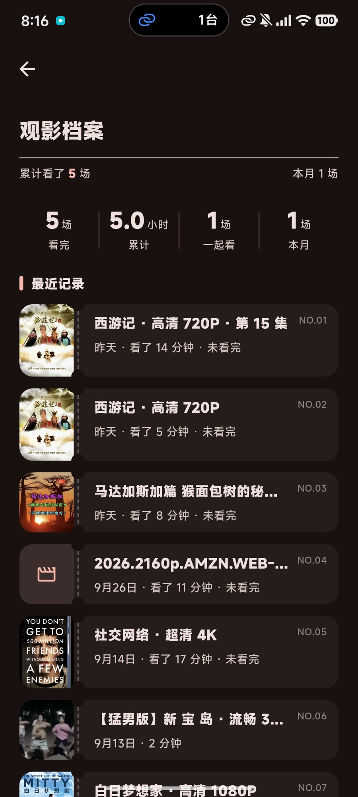

和朋友、家人、另一半同步看同一个视频——进度一致，边看边聊。

[官网](https://syncwe.top/) · [下载](https://syncwe.top/download/) · [新手入门](https://syncwe.top/guide/getting-started/) · [常见问题](https://syncwe.top/help/) · [反馈](https://github.com/SyncweApp/syncwe/issues)

---

https://github.com/user-attachments/assets/93e35c48-e39c-4c2c-965d-fb6330748d30

## 它能做什么

**一起看**
- 房间内播放、暂停、拖动进度实时同步，所有人看到的是同一帧
- 用房间码邀请好友，可设为私密房间
- 边看边聊：聊天、弹幕、语音通话，还能 @ 房间 Bot
- 播放列表，看完一集接着下一集

**片源从哪来**
- 夸克网盘、WebDAV / Alist、Emby 媒体服务器
- 网盘搜索、动漫搜索（基于 XPath 的社区规则）、番剧排期
- 视频解析：粘贴抖音、快手、小红书等 50 个平台的分享链接即可播放
- B 站解析、直播解析（抖音 / 哔哩哔哩）、网页视频嗅探

**播放器**
- 原生、MPV、MDK 三种内核可切换
- 倍速、字幕、音轨切换
- 画中画、DLNA 投屏

**其他**
- 观影档案：记录一起看过的片子
- 私聊、简评、用户排行

## 截图

  
  
  
  

 

  
  
  
   
  
  
  

## 下载

所有安装包都在 [Releases](https://github.com/SyncweApp/syncwe/releases/latest)，也可以从 [官网下载页](https://syncwe.top/download/) 获取。

| 平台 | 安装包 | 系统要求 |
|------|--------|----------|
| Android | `arm64-v8a` / `armeabi-v7a` / `x86_64` 的 `.apk`（大多数手机选 `arm64-v8a`） | Android 7.0+ |
| iOS | `.ipa`，用 AltStore 或 Sideloadly 自签安装 | iOS 15.4+ |
| macOS | `.dmg` | macOS 12.0+ |
| Windows | `windows_x64_setup.exe` | Windows 10+（x64） |

## 仓库

| | |
|---|---|
| [syncwe](https://github.com/SyncweApp/syncwe) | 安装包发布、文档与问题反馈 |
| [SyncweRules](https://github.com/SyncweApp/SyncweRules) | 动漫搜索的社区规则，欢迎提交新规则或修复失效规则 |

联系邮箱：[contact@syncwe.top](mailto:contact@syncwe.top)

## Star History

<a href="https://star-history.com/#SyncweApp/syncwe&Date">
  <picture>
    <source media="(prefers-color-scheme: dark)" srcset="https://api.star-history.com/svg?repos=SyncweApp/syncwe&type=Date&theme=dark" />
    
  </picture>
</a>

© 2025–2026 Syncwe

